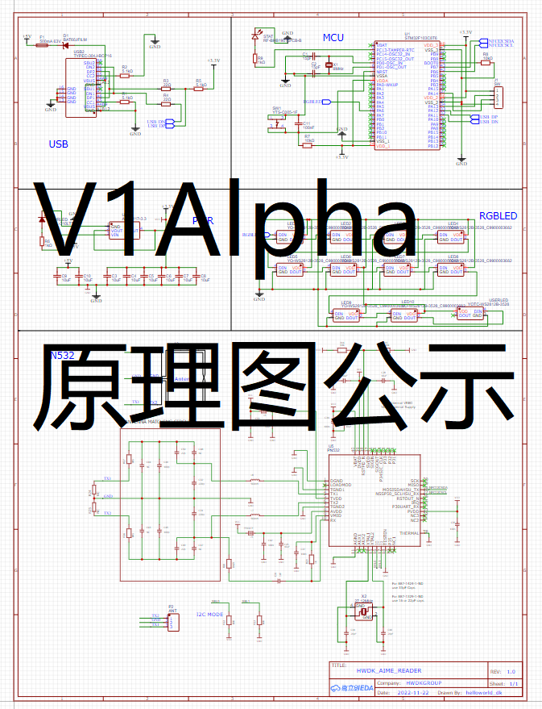
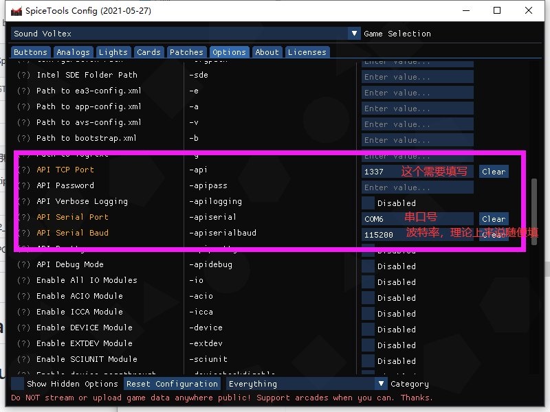
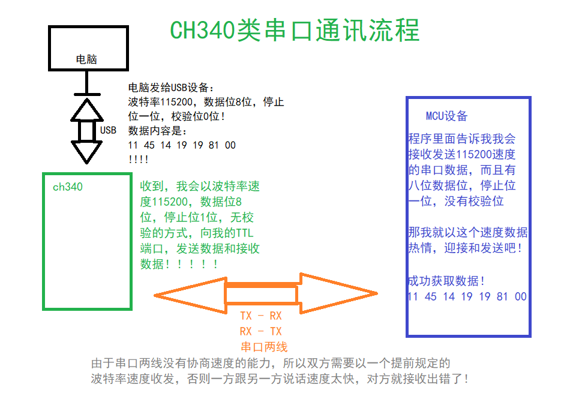
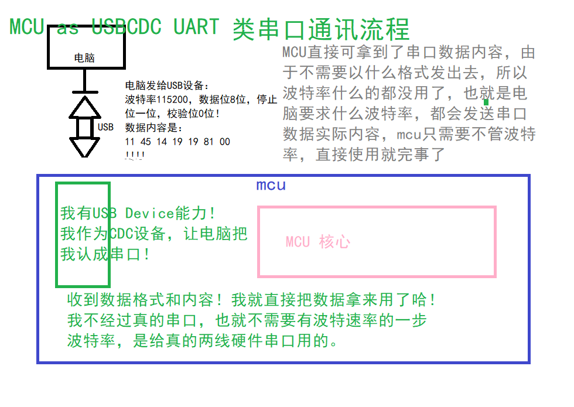

# stm32_aimereader 新方案Se_ga/Kona_mi/NA_MCO三模三社读卡器 成本30  

目前处在v1.0版本，主要工作是干好sbga部分，konami和namco支持为次要  
# stm32duino 的USB串口通信出现的问题已经解决！！！！！
# 初始的NAMCO读卡支持！！，使用自制IO（自制bngrw.dll，基于我修改的Openbanapass），目前支持太鼓达人的基本刷卡（仅分辨不同卡片，未实现卡内真实卡号读取）
# NAMCO|SEGA|KONAMI三模式下的源码和已编译支持直刷的更新包均已上传！！！  
文件比较乱，我之后会整理一下，带来的不便敬请谅解

# SpiceAPI版本读不了Felica的问题已解决！！请已经更新的Spice用户再更新到最新版，源码是“修复版SpiceAPI源码PN532-spiceapi的ino”，最新版更新包已经放在Release！！！！！非常抱歉对大家带来的不便！！！  
# SpiceAPI版本已测与CardIO版本读卡器读取Felica时读到卡号完全一样完全兼容！！！  
# 重磅更新：现已支持SpiceAPI刷iidx，sdvx等，不支持旧版epass，其余mifare和felica大部分卡应该都支持！！！！！！！！不确定与其他读卡器读的卡号一不一样就是，现已发布更新包和已开源！！！！！！！！！！！！！！！！！！！！！！！

# v1.0Release PCB开源已上传！！！！！！！！！！！！！！！！！！！！！！
# 修复了串口的程序已上传！！！！！！！！！！！！

aime读卡器新方案,低价高性能方便使用！

<h1> 我去，我今天才发现怎么开了这个页面但是没写东西！！！ </h1>

v1.0b程序已上传  ！！！！   没写完，只有基础功能！！！   
v1.0b配置器已上传  没写完，很多功能不能用  现在只能调亮度，实时显示，串口，串口自动寻找，查看版本！！！
v1.0bpcb和电路已上传  有bug，现在先不要打板，几天内修！！！！！！！！！打板造成损失与我无关！！   
v1.0bbootloader已上传   短接scl和vcc进bl，或串口进bl   

# 总览

Ver1.0b 总览，制作教程，即将发布！！！

已在咸鱼上架，无屏幕版本40CNY包邮，已经成交过了！
Ver1.0b版本板子全览，此版正常使用，带有一定的瑕疵，也是上传开源的版本，新ver1.0release等待测试中。     
v1release已上传！！    
  
  
  
带屏那个图是开发机，基于v1.0a废板制作的开发用机，跟beta的布线不大一样。

Ver0.1版本板子全览，此版属于废板，532无法正常工作

**HWDK_OPENSOURCE 开源项目**  
**本项目为 Helloworld 团队 Dk 提项并研发验证，作为开源项目，上传Github**  
**商业性：本作品允许合理商业，但作者不支持也不反对，但商业化造成的任何影响和结果，造成任何纠纷与作者无任何关系，板子制作大量运用贴片，使用锡膏和风枪制作会简单一些，但是也很难，不保证所有人都能制作成功**  
**对本作品商业化的额外要求：基于本方案的开源作品，在您的改动不大的情况下（添加图形文字丝印/在程序等地添加自己的标识不计算为改动，若对功能做出改变，如在本基础上添加其他游戏兼容读卡器代码使新代码有意义部分可见字符长度远远大于原来程序，或更改电路PCB，增加无线（？）功能，不受本要求约束！），严厉禁止售卖产生大于10元/个读卡器的利润，使用本项目制作售卖者，我有权查你的原料账单，如果不符合我的要求，有权挂你不让你卖，看看谁能那么厚脸皮！！！！**

文章正在逐步编写，暂时完成一部分

上传的程序是对Sucareto/Arduino-Aime-Reader程序的修改版本，适用于stm32duino，由于stm32duino使用FastLED报错，所以改为Adafruit-Neopixel库，暂发现一定情况下与原程序不一致（？，但影响非常非常非常小，几乎没有，几乎可以说一点也不影响使用

使用教程后续会发，现在简述，首先安装arduino ide，然后安装开发板stm32duino，然后安装pn532库和neopixel库。开发板选择F103 ， 具体选BluePill F103C8T6，因为stm32duino里这个可以跑USB，好像标准C8T6那个stm32duino不大支持。U(S)ART选Enabled(Generic Serial)，USB模式选CDC (Generic Serial supersede U(S)ART)，USB速度Low/Full，吸不吸氧(优化)，氧气（-O2）还是臭氧(-O3)随意，因为程序对速度没有要求，选择不优化已经足够可以，然后选择合适下载器编译下载即可。（如果你没有列表支持下载器，请在项目栏选择导出编译好的二进制，hex/bin文件将会生成在项目文件夹，使用其他软硬件比如J-flash，jlink下载即可），程序默认LED在PA6，pn532接在第一个I2C即可。（烧录完成请重新拔插设备以使usb生效！）

本文章方案内容和其中所述设备为使用 Sucareto/Arduino-Aime-Reader 程序的 Aime 兼容读卡器

**注意！本方案的测试作品还在制作中，基本软件程序已经开发测试完成，PCB的MCU主控部分和灯都正常工作，但是532部分暂未调起来！！！不要直接打板！！本文章暂且只做方案展示，不作教程，后续测试V1Alpha成功后，将会发布V1正式版PCB文件和教程！！！！**

以下是本方案(V1/V1Alpha)特色：  

1. 使用 STM32F103C8T6 作为主控芯片，此芯片支持USB Device-FS，可以直接作为一个 USB-CDC 设备接入计算机，并在计算机上显示为一个 USB 串行设备（串口），免去了CH340一类USB转串口芯片的成本，且不用Atmega32U4的高价格，做到了低价（每片5-10元）同时，也带来一些独特的优势（下面会讲到）。
2. 使用 USB-CDC 的优势： a. 免驱动，即插即用，无需像ch340一样安装驱动。b.不经过实际的"TTL"，"RS-232"环节，无需波特率通信速度设定，所以可以兼容在任意波特率下免设置即使用，免去了切换38400和115200的麻烦。（原理下面讲述）
3. 所有元件全部贴片于一张PCB，整个PCB浑然一体，减少了厚度。无需插模块，也避免了模块卖家的利润对读卡器的成本造成增加。由于pn532也做在pcb上，可以借用读卡器较大的面积，铺设更大的天线，做好天线匹配应该能做出比小模块更好的读取效果。
4. 我将所有元件设计于同一面，LED使用元件面反贴方式沉板，使整个读卡器正面是一整个平面，白色的阻焊非常美观，而且方便装配（贴）亚克力片或其他片状物体装饰。
5. 由于屏幕确实没有很大必要，且造成十多元成本，所以将屏幕去除做到正面平整。但是为了满足更多人需求，我将线圈从V0.1内部测试失败版的中间向下挪，在pcb上方留出空隙，并做了I2C OLED所用的四个开窗焊点，这样可以一个板子实现加与不加屏两种型号，而且小的焊盘基本不影响正面外观。焊点也有考量，选择屏幕居中放置时屏幕遮挡的位置，这样在安装屏幕后将隐藏连线。
5. 借用线圈下移和屏幕在上的竖版布局，在线圈周围加了一圈一共十个环绕的WS2812，这样整个的布局会接近官方读卡器，更美观。

以下是本方案成本计算

PN532 是本方案占成本最多的单个元件，淘宝一片532裸片就是12元，不过比18元的模块还是便宜    
STM32F103C8T6 5-10元，亦可选用国产替代版本，约2-3元，由于读卡器占用内存较小，也可选择C6T6，更便宜  
PCB jlc每月免费10张，若出货量大，则计算二十张每张平均为1元  
外围贴片元件 极其便宜，虽然每份都是1-2元，但是每份（1-2元）是50个甚至200个，平均每个元件几分钱不到  

总计约 12+8+5约25左右，如果买到的价格略高，也不应该超过30元/每个读卡器

由于未完成方案最终验证，不提供相关生产文件，若测试成功则后续上传！

Ver1.0Alpha 原理图公示 此版本已经打板未到，未测试！

# SpiceAPI使用教程：  
建议串口：COM6  
不建议使用：COM1  
刷不动的话建议更新你的SpiceTool： https://github.com/spicetools/spicetools  
（进去在Release里面下载最新的，使用三个EXE替换旧的）  
  

# CH340 | MCU 内置USB 原理

**总结：为什么要有波特率？是因为需要在真正的两线串口等地，为了防止双方速率不统一，所以电脑需要给设备发一个波特率来告诉USB转串口TTL设备应该以什么速度发给串口TTL设备，数据则以USB方式直接发给USB转串口TTL设备，MCU as USBCDC UART其实就是单片机直接接收到了电脑的数据和速度要求，但是由于不需要经过真实TTL，所以可以直接把电脑发来的原始数据拿来使用，换句话说，MCU现在变成了340。这样双方实际上在用USB传输原始数据，这样也不需要什么速率了**  
~~MCU：我沐浴在数据中！~~

~~发现有人居然说使用了CDC额外实现自适应波特率和热插拔，热插拔首先是所有USB串口设备都有的，根本不是他实现的，而且也不是额外的，这是大家都有的。另谈“自适应”，说的像他写了什么厉害程序，能自动识别来自硬件双线TTL发来的数据速度呢，实则是MCU内置USB然后作为CDC设备的自带特性，根本不是他“实现”的，用这种方式表达了两个人家自带的特性，这就是营销手段吗hhhh，让别人觉得很厉害呢~~
